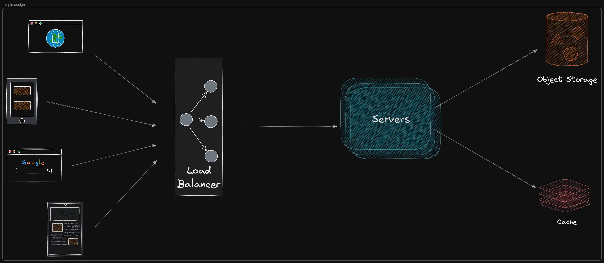
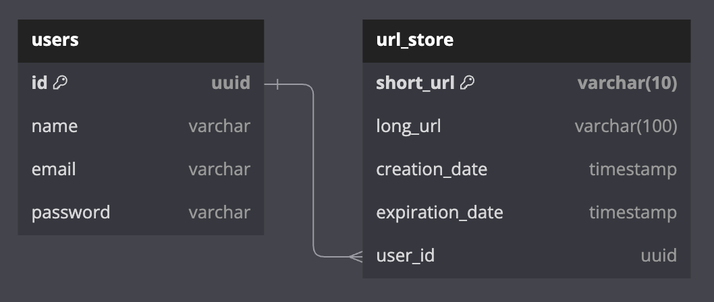

# Design a URL Shortener - shortly

Shortly is a URL shortening service that converts long URLs into shorter, manageable links. It also provides analytics for the shortened URLs.

1.  **Requirements:**

    1. **Functional Requirements:**

       - Generate the short url for given long url.
       - Every url must be unique.
       - Redriect user to orignal long url when click on short url.
       - User can customize the url (optional).
       - Set the short user expriation time.
       - Provide analytics to link usage.
       - May save the user information (optional).

    2. **Non Functional Requirements:**

       - High availability (the service should up like 99.9% time).
       - Low latency (redirect to url should heppen in ms).
       - Scalability (the system handle 1M records per day).
       - Security to prevent malicious use, such as phishing.

2.  **Assumptions:**

    - **Daily requests per day to short urls** ~ 1000000.
    - **Read and Write ratio:** 100:1 (for every URL creation, we expect 100 redirects).
    - **Peak Traffic:** 10x of the average load.
    - **Orignal Url length:** 100 characters.

3.  **Capacity Estimation:**

    2. **Throughput Requirements:**

       - **Average write per second (WPS):** (1,000,000 requests / 24 \* 60 \* 60 seconds) ~ 12
       - **Peak WPS:** 12 \* 10 = 120
       - **Average read per second (RPS):** 12 \* 100 = 1200
       - **Peal RPS:** 10 \* 1200 = 12000

    3. **Storage Estimation:**

       - We need the following informations for each URL.
         - **Short URL:** 7 characters
         - **Long URL:** 100 characters
         - **CreationDate:** 8 bytes (timestamp)
         - **ExpirationDate:** 8 bytes (timestamp)
         - **ClickCount:** 4 bytes (integer)
         - **UserID:** 8 bytes.
       - Total storage:
         - **Storage per URL:** 7 + 100 + 8 + 8 + 4 + 8 = 135 bytes
         - storage for one year:
           - **Total URLs per Year:** 1,000,000 × 365 = 365,000,000
           - **Total Storage per Year:** 365,000,000 × 135 bytes ~ 48 GB

    4. **Bandwidth Estimation:** (optional)
       Assuming the HTTP 301 redirect response size is about 500 bytes (includes headers and the short URL).

       - **Total Read Bandwidth per Day:** 10000000 \* 100 \* 500 bytes = 50 GB / day
       - **Peak Bandwidth:** 500 bytes × 12,000 RPS = 6 MB/s (the peak bandwidth could be as high average).

    5. **Caching Estimation:**

       - The system is ead heavy so using cache can reduce the latency for read requests.
       - Can cache hot URLs, can identify the URLs where 20% of the URLs generate 80% of the read traffic.
       - 1 million writes per day, and cache only 20%, so the formula will be:
         - 1M \* 0.2 \* 135 Bytes ~ 26M
         - Cache hit ratio: 90:10

    6. **Infrastructure Sizing:**
       - **API Servers:** start with 1-2 instances each capabile of 200 to 300 RPS.
       - **Database:** single database node to handle both storage and high read/write throughput.
       - **Cache Layer:** single node, depending on the load and cache hit ratio.

4.  **High Level Design:**

    On a high level, we would need following components in our design:

    - **Load Balancer:** Distributes incoming requests across multiple application servers.
    - **Application Servers:** Handles incoming requests for shortening URLs and redirecting users and analytics (optional).
    - **Database:** Stores mappings between short URLs and long URLs.
    - **Cache:** Stores frequently accessed URL mappings for faster retrieval.

    **NOTE:** we can split the services to write and read sperate services.

    

5.  **Database Design:**

    1. **SQL vs NoSQL:**
       To choose right database we need to understand our need. Let consider some factors:
       - We need to store billion records.
       - Read queries are much higher then the write.
       - We don't need joins.
       - Highly scalable and available.

    Given these points, a NoSQL database like MongoDB, Cassandra are better option due to their ability to efficiently handle billions.

    2. **Schema Design:**
       In inital stage we need only two tables which are store data. One is to store the user related database and the other table store the information about url.

       1. users
       1. url_store

       

6.  **System API Design:**
    Design RESTful APIs that are efficient and scalable. We need following API implement the basic CRUD on urls and also provide the user registration and login endpoints. Here are the LIST of APIs needed to achieve the core functionality of a system.

    1.  **URL Shortening:**
        **Endpoint: POST ->** `/api/v1/shorten`: We can make access the user with and without onboarding to the system.

        - Sample Request body:

          ```json
          {
            "long_url": "https://www.example.com/some/very/long/url",
            "custom_alias": "optional_custom_alias",
            "expiration_date": "optional_expiration_date"
          }
          ```

        - Sample Response body:

          ```json
          {
            "short_url": "https://www.example.com/abc123"
          }
          ```

    2.  **URL Redirection API:**
        **Endpoint: GET ->** `/api/v1/redirect/{short_url_key}`

        - Sample Response

          HTTP/1.1 301 Found
          Location: https://www.example.com/some/very/long/url

    3.  **User Registration:** (optional)
        **Endpoint: POST ->** `/api/v1/register`: Onboard the user to the system

        - Sample Request body:

          ```json
          {
            "name": "name",
            "email": "email@email.com",
            "password": "password"
          }
          ```

        - Sample Response body: (OK case) and otherwise return error message

          ```json
          {
            "message": "user register successfully"
          }
          ```

    4.  **User Login:** (optional)
        **Endpoint: POST ->** `/api/v1/login`: Give access user to the system.

        - Sample Request body:

          ```json
          {
            "email": "email@email.com",
            "password": "password"
          }
          ```

        - Sample Response body: (OK case) and otherwise return error message

          ```json
          {
            "access_token": "access_token",
            "refresh_token": "refresh_token"
          }
          ```

7.  **Deep Dive:**

    1. **URL Generator:** A function which generate the short, unique url for give long url by user.
       Here are some point which the shorten url algorithm work:

       - We need to ensure that the short codes are unique.
       - We want the short codes to be as short as possible
       - We want to ensure codes are efficiently generated.

         Let's compare view possible ways to achieve this functionality.

         - **Long URL Prefix or Postfix:** We can use the short url key from the entered long user by the user via a function, which take a prefix (7 characters) or postfix also (7 characters) from the url string and save in database.

           - PROS and CONS:
             - Easy to implement the logic.
             - Not meet constraint #1 about uniqueness.
             - Two or more short url have the same prefix or postfix.

         - **Random Number Generator or Hash function:** An other approach is to generate the Random number and which could be used as the short code for url. Additionally, we can check the generated number in database and if it exist create the new. This approach make the query slow.
           Alternatively, we could use the hash function with fixed-size hash code. The both approaches use the base64 format, compact representation of numbers that uses 62 characters (a-z, A-Z, 0-9).

           - PROS and CONS:
             - Batter approach when the size of url records are not increases that much.
             - We can generate a short code without requiring any knowledge of the URL being shortened.
             - Easy to implement.
             - Duplicate short codes, especially as the number of stored URLs increases.
             - Detecting and resolving collisions requires additional database checks for each new code, adding latency and complexity to the system.

         - **Counter with base64 Encoding:** Using a global counter with Redis ensures unique, collision-free short codes by atomically incrementing the counter. The counter's value is Base62-encoded, creating compact, scalable, and efficient URL identifiers.

           - PROS and CONS:
             - Each counter value is unique, eliminating the risk of collisions without additional checks.
             - Base62 encoding keeps short codes concise, even for large numbers (e.g., 1 billion URLs = 6 characters).
             - Supports a massive number of URLs (e.g., 6 characters can encode up to 62^7 over 3.5 trillion).
             - Synchronizing a global counter across multiple servers can be challenging in distributed environments.
             - If a URL is shortened multiple times, each instance gets a new code, leading to duplicates in some cases.

    2. **Link Expiration:**

    3. **URL Redirection:**

    4. **Analytics (optional):**
