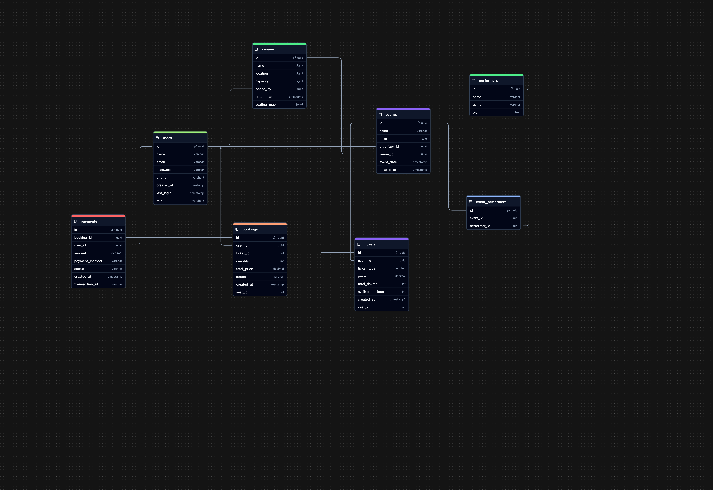

# Design a Ticketmaster

Ticketmaster is an online platform that allows users to purchase tickets for concerts, sports events, theater, and other live entertainment.

1.  **Requirements:**

    1. **Functional Requirements:**

       - User should be aboe to view events.
       - User should be able to dearch for events.
       - User should be able to book tickets for events.
       - User should be able to view their booked events.
       - Admin or event coordinators should be able to add events.
       - Popular events should have dynamic pricing.
       - Admin or event coordinators should be able to remove the events.
       - Should should be able to see the avaiable seats for the event.
       - Process payments for book event (optional).
       - Generate and validate seats/tickets (optional).
       - Revers the book event (cancel the booked event) after certain time.

    2. **Non Functional Requirements:**

       - The system should prioritize availability for searching.
       - The system should not book a ticket more the one time for specific user (if the booking event is active).
       - The system should be scalable and able to handle high throughput in the form of popular events (10 million user, one event).
       - The system should have low latency search (< 500ms)
       - The system is read heavy, and thus needs to be able to support high read throughput (100:1).
       - The system should protect user data and adhere to GDPR (General Data Protection Regulation).
       - The system should be fault tolerant.
       - The system should provide secure transactions for purchases.
       - The system should be tested and east to deploy.
       - The system should have regular backups.

2.  **Assumptions:** Here are some for a Ticketmaster-like application based on your assumptions

    - **Requests:** 1M daily.
    - **Read-Write:** 100:1 ratio.
    - **Peak Load:** Scales to 10M requests.
    - **Caching:** Caches popular data to reduce load on the database.

3.  **Capacity Estimation:**

    1.  **Throughput Requirements:**

        - **Peak Traffic:** Assume major ticket sales (e.g., concerts, sports events) drive huge spikes in traffic.
        - **Requests per Second (RPS):**
          - Normal traffic: ~1K-10K RPS (depending on region/popularity).
          - Peak traffic: ~100K-500K RPS (flash sales for major events).

    2.  **Storage Estimation:**

        - **Event Data:** ~500 bytes per event.
        - **Ticket Inventory:** ~1KB per ticket.
        - **User Data:** ~2KB per user.
        - **Order Data:** ~5KB per transaction.
        - **Estimated Growth:**
          - 1M events/year → 500MB per year for event data.
          - 100M tickets/year → 100GB per year for ticket data.
          - 10M users → 20GB total for user profiles.
          - 50M orders/year → 250GB per year for order history.
          - Total Annual Storage Requirement: ~500GB-1TB (excluding logs, backups).

    3.  **Bandwidth Estimation:** (optional)

        - **Average API Response Size:** ~5KB per request.
        - **Peak RPS:** ~500K RPS → 2.5GB/sec bandwidth requirement.
        - **Streaming Seat Maps & Images:** Additional 100-500Mbps overhead.

    4.  **Caching Estimation:**

        - **Event Listings:** High cacheability, updated every few minutes.
        - **Ticket Availability:** Short-lived cache (~30s), refreshed in real-time.
        - **User Session Data:** Cached for 15-30 mins to reduce DB lookups.
        - **Order Status:** Cached for a few minutes for better UX.
        - **Cache Hit Ratio Goal:** 80-90% to reduce DB stress.
        - **Redis/Memcached Size:** ~500GB RAM to handle peak loads.

    5.  **Infrastructure Sizing:**

        - **Web Servers:** ~100-200 instances (auto-scaled).
        - **Database:** 10-50TB storage, read replicas for scale.
        - **CDN:** For static assets.
        - **Queue System:** Kafka/RabbitMQ/SQS for async tasks.
        - **Search Engine:** Elasticsearch for event lookups.
        - **Load Balancer & Autoscaling:** To handle traffic spikes.

4.  **High Level Design:**

    On a high level, we would need following components in our design:

    1. **User Interface (UI):** Customer interact with the website or app to browse events, book tickets, and pay.

    2. **Load Balancer:** Distributes incoming requests across multiple application servers.

    3. **Application Servers:** Handles all the important processes.

       - **Event Management:** Manages event details.
       - **Ticket Management:** Handles ticket availability and booking.
       - **User Management:** Manages user accounts and logins.
       - **Payment Processing:** Handles payments for ticket bookings.

    4. **Database:** Single database stores all the data, like event details, tickets, user information, and payments.

    5. **External Integrations:** Connects to third-party services for payments (PayPal, Stripe) and sending email/SMS confirmations.

    6. **Cache:** Caches popular data to reduce load on the database.

    

5.  **Database Design:**

    1. **SQL vs NoSQL:**
       To choose right database we need to understand our need. Let consider some factors:
       - We need to store billion records.
       - Read queries are much higher then the write.
       - We do need joins.

    Given these points, a SQL database like Postgres, MySQL are better option.

    2.  **Schema Design:** To satisfy our key functional requirements, we'll need the following entities

        1. Events
        2. Users
        3. Performers
        4. Venues
        5. Tickets
        6. Bookings
        7. Payments

        

6.  **System API Design:**

7.  **Deep Dive:**
